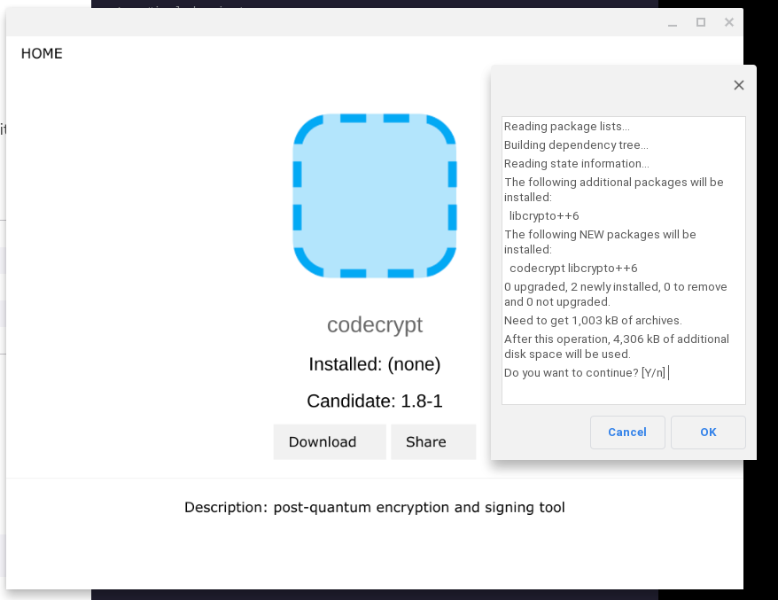

# IXGraphine - version 0.24 Pulled from original HUSKI3 repo, maintainer not present yet


---

[](https://github.com/HUSKI3/IXGraphine/issues)
[](https://www.python.org/)
[](https://travis-ci.org/joemccann/dillinger)

> IXGrapine is a sleek, fast and powerfull application store built for IXOS.

# New Features!

  - Epic Flask backbone
  - Chromium powered interface 

### Installation

IXGrapine requires [Spark](https://github.com/HUSKI3/Spark/) to run.

Install the package and run it!

```sh
$ spark install ixgraphine
$ ixgraphine
```

To run from raw
```sh
$ chmod +x ixgraphine && ./ixgraphine 
```
### Plugins

Future support intended...


### Development

Want to contribute? Great!

IXGraphine is licenced under Apache 2, all contributions are welcome!

#### Building from source

```sh
$ git clone https://github.com/HUSKI3/IXGraphine/
$ python3 build.py
```

### Todos

 - banan
 - some other stuff
 - add bootifull UI

License
----

Apache 2.0

